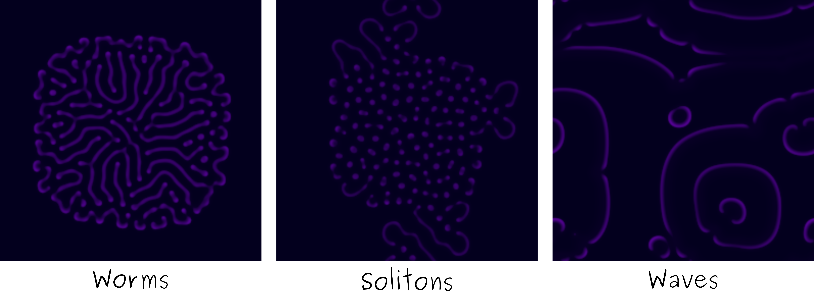

Reaction diffusion systems
==========================

.. include:: start_section.rst

Gray-Scott
----------

The Gray-Scott reaction diffusion system consists in two layers of reactants whose concentrations `u(x,t)`, `v(x,t)`, with `x` a 2D position on a regular lattice, follow the differential equation :

.. math::

  \frac{\partial u}{dt}(x,t) = D_u \nabla^2 u - u v^2 + f \dot (1 - u)\\
  \frac{\partial v}{dt}(x,t) = D_v \nabla^2 v + u v^2 - (f + k) v

Depending on the values of the feed `f` and kill `k` parameters, this system exhibits the formation of patterns such as the one depicted below.

The above pictures have been generated with the following settings :

============= =================== ==================== ======== ========
Name          Du `(10^{-5})`      Dv  `(10^{-5})`      f        k
============= =================== ==================== ======== ========
Worms         `2.2`               `0.9`                0.046    0.063
------------- ------------------- -------------------- -------- --------
Solitons      `2.2`               `0.9`                0.03     0.062
------------- ------------------- -------------------- -------- --------
Waves         `2.2`               `0.9`                0.014    0.045
============= =================== ==================== ======== ========

The integration of the equation was performed with forward Euler with `\Delta t = 1.0`.

If you want to play with the system, test the `webgl demo <../../webgl/grayscott/index.html>`_.

.. An earlier demo on `<https://github.com/jeremyfix/GrayScott>`_
